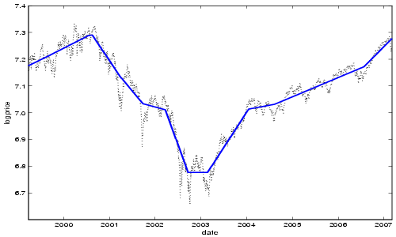

sp500 Example
================

Another approach to segmentation is given by Koh, Kim, and Boyd's L1-Trend filter (refs [here](http://web.stanford.edu/~boyd/l1_tf/) and [here](http://web.stanford.edu/~boyd/papers/l1_trend_filter.html)). The approach is to, given a sequence *y* of length *N*, use a global optimizer solve for a *x* minimizing:

(1/2)||*x* − *y*||<sub>2</sub><sup>2</sup> + *λ*||*D**x*||<sub>1</sub>

where *D* is the second-order difference matrix that calculates *x*<sub>*k* − 1</sub> − 2*x*<sub>*k*</sub> + *x*<sub>*k* + 1</sub> for all *k*. Or in other words find *x* minimizing:

$$(1/2)||x-y||^2\_2 + \\lambda \\sum\_{k=2}^{N-1} |x\_{k-1} - 2 x\_{k} + x\_{k+1}|$$

They call the above Hodric-Prescott Filtering. It is *very* important to note that this sort of filtering is *not* appropriate for forecasting time-series (or *ex ante* work), as it is moving data from the future into the estimate in 2 ways:

-   *x*<sub>*k* + 1</sub> is directly in the penalty term for *x*<sub>*k*</sub> (moving fit quality information known at time *k* + 1 to time *k*).
-   It is using a global optimization to find all *x* simultaneously, meaning choices of later *x* can affect earlier choices.

However, this sort of can be used to look at *ex post* (after the fact) changes in behavior.

Richard Bellman wrote about a related smoothing filter in *Dynamic Programming*, Princeton 1958, Ch 1, section 7, minimizing:

$$\\sum\_{k=1}^{N} g\_k(x\_{k} - r\_{k}) + \\sum\_{k=2}^{N} h\_k(x\_{k} - x\_{k-1})$$

(here we are solving for *x*, given *r* and the *g*<sub>*k*</sub>() and *h*<sub>*k*</sub>() are sequences of arbitrary penalty functions.

Koh, Kim, and Boyd supplied [implementations of the method in both Matlab and C](http://web.stanford.edu/~boyd/l1_tf/), and Hadley Wickham provided a wrapper to make the `C` code available to [`R`](https://www.r-project.org) users. Dirk Eddelbuettel worked on an [`Rcpp` adaption of the methodology](https://github.com/eddelbuettel/rcppl1tf).

The idea is: one can take series data (such as historic S&P 500 prices) and, by picking a smoothing *λ* produce a graph such as the following:



[`RcppDynProg`](https://github.com/WinVector/RcppDynProg) uses a different, but related methodology. The user can specify any per-interval penalty, meaning fit quality does not have to be per-point additive. The default metric is the quality of a linear fit on the segment (discussed [here](https://winvector.github.io/RcppDynProg/articles/RcppDynProg.html)). Then by specifying a bound on the number of segments or a per-segment penalty (to discourage many small segments) a piecewise linear approximation is built up using a global dynamic program optimizer. Again: the non-local nature of the segment quality scores (the default score depends on all points in the segment, not just previous points) plus the global optimization mean the segmentation is only available after all the data are known (so not suitable for forecasting a time series forward).

That being said the results look like the following.

``` r
library("RcppDynProg")
library("ggplot2")

# Data from: https://github.com/eddelbuettel/l1tf/blob/master/data-raw/sp500.csv
sp500 <- read.csv("sp500.csv")
sp500$date <- as.Date(sp500$date)

sp500$x <- as.numeric(sp500$date)
sp500$permuted <- sp500$raw[sample.int(nrow(sp500), nrow(sp500), replace = FALSE)]


soln <- solve_for_partition(sp500$x, sp500$raw, penalty = 250000)
sp500$estimate <- approx(soln$x, soln$pred, 
                         xout = sp500$x, 
                         method = "linear", rule = 2)$y
sp500$group <- as.character(
  findInterval(sp500$x, soln[soln$what=="left", "x"]))

ggplot(data = sp500, aes(x = date)) +
  geom_line(aes(y=raw), color = "lightgray") +
  geom_line(aes(y=estimate, color = group)) +
  ggtitle("segment approximation of historic data",
          subtitle = "per-segment penalty = 250000")
```


Notice in our definition of piecewise we do not insist the pieces touch. A smoother that enforces that can be found [here](https://github.com/WinVector/vtreat/blob/master/R/segmented_variable.R) (demonstrated [here](https://github.com/WinVector/RcppDynProg/blob/master/extras/SegmentationL.md) as `PiecewiseV`).

Or, instead of specifying a penalty, the user can specify a bound on the number of segments allowed.

``` r
soln <- solve_for_partition(sp500$x, sp500$raw, max_k = 5, penalty = 0)
sp500$estimate <- approx(soln$x, soln$pred, 
                         xout = sp500$x, 
                         method = "linear", rule = 2)$y
sp500$group <- as.character(
  findInterval(sp500$x, soln[soln$what=="left", "x"]))

ggplot(data = sp500, aes(x = date)) +
  geom_line(aes(y=raw), color = "lightgray") +
  geom_line(aes(y=estimate, color = group)) +
  ggtitle("5 segment approximation of historic data")
```


Or instead of specifying the penalty we can attempt to solve for a plausible value using a permutation test.

``` r
# look for a penalty that prefers 1 segment on permuted data
lb <- 0
ub <- 100
while(TRUE) {
  soln <- solve_for_partition(sp500$x, sp500$permuted, penalty = ub)
  if(nrow(soln)==2) {
    break
  }
  lb <- ub
  ub <- 10*ub
}
while(TRUE) {
  penalty <- ceiling((lb+ub)/2)
  if(penalty>=ub) {
    break
  }
  soln <- solve_for_partition(sp500$x, sp500$permuted, penalty = penalty)
  if(nrow(soln)==2) {
    ub <- penalty
  } else {
    lb <- penalty
  }
}
print(penalty)
```

    ## [1] 1728621

``` r
soln <- solve_for_partition(sp500$x, sp500$raw, penalty = penalty)
sp500$estimate <- approx(soln$x, soln$pred, 
                     xout = sp500$x, 
                     method = "linear", rule = 2)$y
sp500$group <- as.character(
  findInterval(sp500$x, soln[soln$what=="left", "x"]))

ggplot(data = sp500, aes(x = date)) +
  geom_line(aes(y=raw), color = "lightgray") +
  geom_line(aes(y=estimate, color = group)) +
  ggtitle("segment approximation of historic data",
          subtitle = paste("per-segment penalty =", penalty))
```


